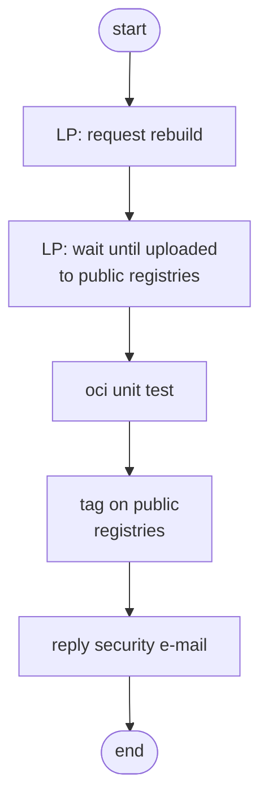
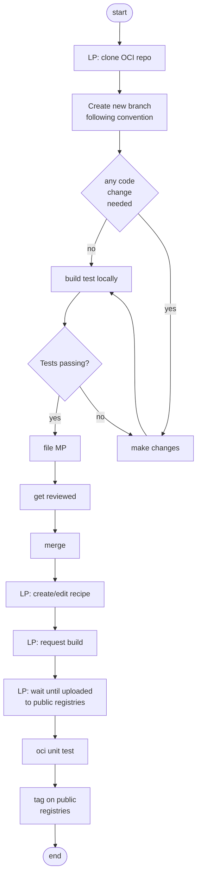
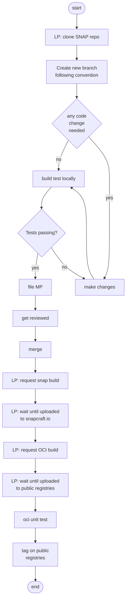

# ROCKS updating

## Outdated packages

When packages in OCI are marked as outdated **without** changes in packaged application (no major/minor release), i.e. no changes in `Dockerfile` or release tag, and **without** changes in the base image.

For each affected tag, do:

## Update the application version (deb-based)

When the packaged application has a version bump, e.g. `redis-6.0 -> redis-6.1`. Each application have it's own versioning rule, in the sense to when it makes sense to bump the tag or not given a change in major or minor release.

## Update the application version (snap-based)

### Special notes
- kafka (and other java-based) depends on gradle plugin to build, which is deprecated
- security notification comes only for the snap package (not for the ROCK)
- kafka snap repo has a `rock` and a `main` branch, which publish to respective store channels

